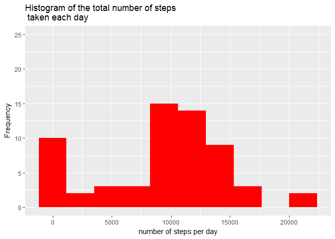
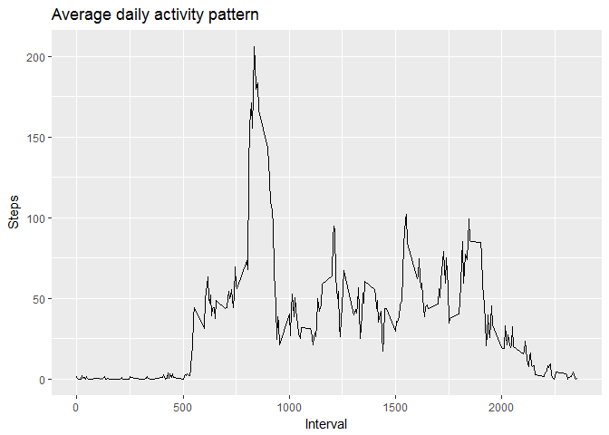
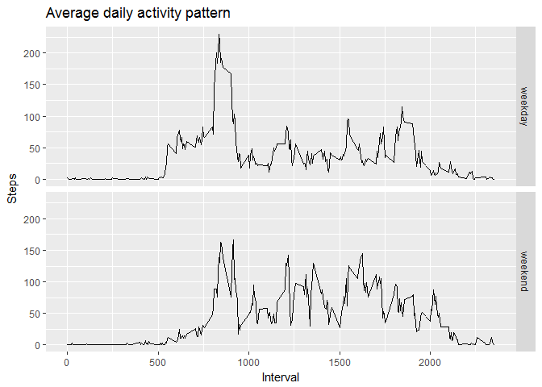

## Loading and preprocessing the data
The first operation to do is unzipping the datasets file "activity.zip" in the 
working directory and then loading it in an R dataframe

```r
# unzipping
unzip("./activity.zip",exdir="./.")
# reading the dataframe
df <- read.csv("activity.csv")
```

## What is mean total number of steps taken per day?
In order to study the average daily activity, we are going to plot a Histogram 
of the total number of steps taken each day

```r
# Total steps per day
daily_steps <- with(df, tapply(steps, date, sum, na.rm=T))
# mean & median
mean_steps <- mean(daily_steps)
median_steps <- median(daily_steps)
# histogram
library(ggplot2)
qplot(daily_steps, geom="histogram", 
      bins=10, fill=I("red"),
      main="Histogram of the total number of steps\n taken each day",
      ylim=c(0, 25),
      xlab="number of steps per day",
      ylab="Frequency")
```

<!-- -->

```r
# mean
mean_steps
```

```
## [1] 9354.23
```

```r
# median
median_steps
```

```
## [1] 10395
```


## What is the average daily activity pattern?
In order to study the average daily activity pattern, we are going to plot the
average number of steps in each interval across all days:

```r
# Average number of steps in each day interval
interval_steps_mean <- with(df, tapply(steps, interval, mean, na.rm=T))
# plot
average_activity <- aggregate(steps ~ interval, data=df, mean)
ggplot(average_activity, aes(interval, steps)) + 
  geom_line() + 
  ggtitle("Average daily activity pattern")+
  xlab("Interval")+
  ylab("Steps")
```

<!-- -->

```r
# interval with max average steps
max_steps_interval <- as.integer(names(which.max(interval_steps_mean)))
# correspondin interval in hh:mm
hh <- max_steps_interval %/% 60
mm <- max_steps_interval %% 60
```
The interval with maximum average number of steps is 13 hours and 55 minutes.

## Imputing missing values
First of all, calculating the number of rows with NA values.

```r
# number of NA
na_number <- sum(is.na(df))
na_number
```

```
## [1] 2304
```

Then filling the na value with the average number of steps in the 5-minutes intervall
across all the days


```r
# defining the filling function
my_function_fill_na <- function(x_steps, y_interval){
  if(is.na(x_steps)){
    return(as.integer(interval_steps_mean[as.character(y_interval)]))
  } else {
    return(x_steps)
  }
}
# applying the filling function across the rows of the new dataframe
df_filled <- data.frame(df)
df_filled$steps <- mapply(my_function_fill_na, df_filled$steps, df_filled$interval)
```

Comparing now the filled dataframe with the original one

```r
# Total steps per day
daily_steps_filled <- with(df_filled, tapply(steps, date, sum, na.rm=T))
# mean & median
mean_steps_filled <- mean(daily_steps_filled)
median_steps_filled <- median(daily_steps_filled)
# histogram
library(ggplot2)
qplot(daily_steps_filled, geom="histogram", 
      bins=10, fill=I("red"),
      main="Histogram of the total number of steps\n taken each day from filled dataframe",
      ylim=c(0, 25),
      xlab="number of steps per day",
      ylab="Frequency")
```

<!-- -->

```r
# mean
mean_steps_filled
```

```
## [1] 10749.77
```

```r
# median
median_steps_filled
```

```
## [1] 10641
```

The mean and the median of the total number of steps per day raised when we fill
the miising values. This fact was predictable because in the original dataframe
the missing values where removed and so considered as null in the calculations.
This fact is clear when comparing the two histograms of the filled and the original
dataframe.


## Are there differences in activity patterns between weekdays and weekends?
First of all, defining the new feature indicating whether a given date is a weekday
or weekend day in the new filled dataframe.

```r
# Date and Time conversion
Sys.setlocale("LC_TIME", "English")
```

```
## [1] "English_United States.1252"
```

```r
# defining the weekend/weekday filling function
my_function_weekend <- function(x_date){
  if(weekdays(as.Date(x_date)) %in% c("Saturday", "Sunday")){
    return("weekend")
  } else {
    return("weekday")
  }
}
# applying the filling function across the rows of the new dataframe
df_filled$days <- mapply(my_function_weekend, df_filled$date)
```

Then, plotting the corresponding the average number of steps taken, averaged across
all weekday days or weekend days


```r
average_activity_filled <- aggregate(steps ~ interval + days, data=df_filled, mean)
ggplot(average_activity_filled, aes(interval, steps)) + 
  geom_line() + 
  facet_grid(days ~ .)+
  ggtitle("Average daily activity pattern")+
  xlab("Interval")+
  ylab("Steps")
```

<!-- -->


